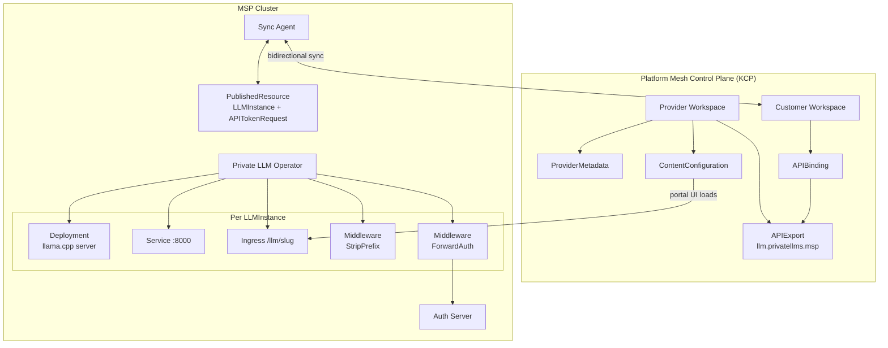
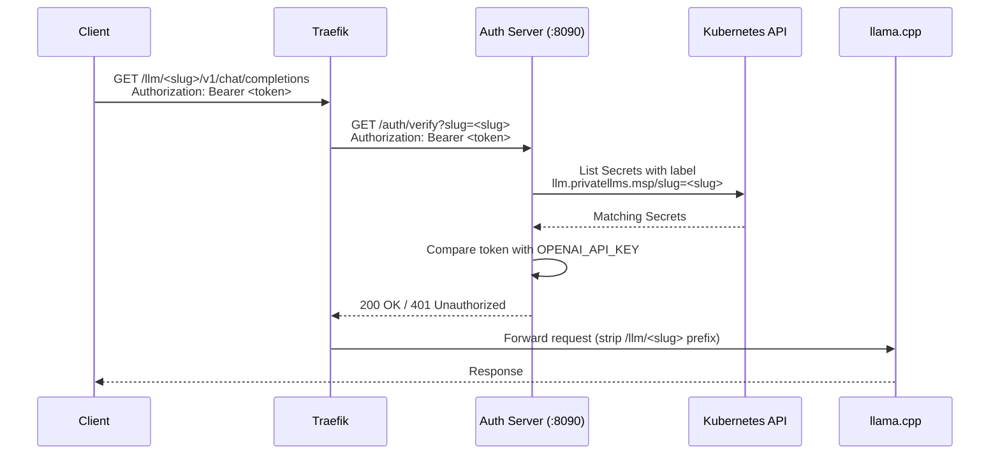
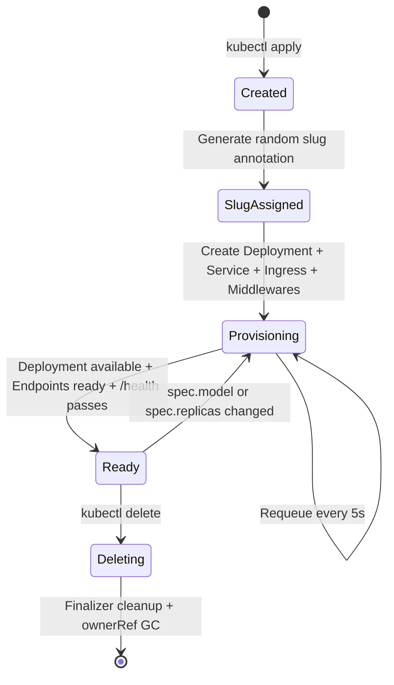
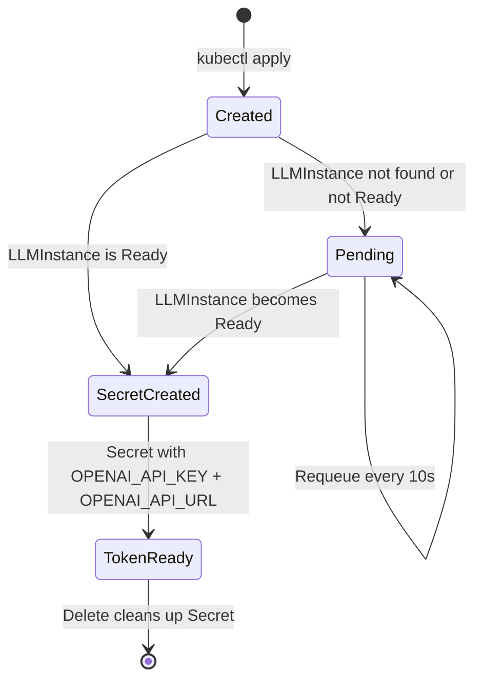

# Architecture

This document describes the Private LLM Operator's architecture, its components, and how they interact within the ApeiroRA Platform Mesh ecosystem.

---

## System Overview

The Private LLM Operator follows a layered architecture that separates concerns across three distinct planes:



## Components

### Private LLM Operator

The core component. A Go-based Kubernetes operator built with [Kubebuilder](https://book.kubebuilder.io/) and [controller-runtime](https://github.com/kubernetes-sigs/controller-runtime).

**Two controllers:**

| Controller | Watches | Creates/Manages |
|-----------|---------|-----------------|
| `LLMInstanceReconciler` | `LLMInstance` | Deployment, Service, Ingress, Traefik Middlewares |
| `APITokenRequestReconciler` | `APITokenRequest`, `LLMInstance` | Secret (with OPENAI_API_KEY and OPENAI_API_URL) |

**Key design decisions:**

- **Slug-based routing** -- Each LLMInstance gets a random 12-character URL slug stored as an annotation. This avoids exposing namespace names in public URLs.
- **Owner references** -- All child resources (Deployment, Service, Ingress, Middleware) are owned by the LLMInstance CR, enabling garbage collection on deletion.
- **Finalizers** -- Both controllers use finalizers to ensure cleanup of associated resources.
- **Health probing** -- The operator probes the llama.cpp `/health` endpoint before marking an instance as Ready.

### Auth Server

A lightweight HTTP server embedded in the operator binary, listening on `:8090`.



The auth server validates tokens by:
1. Extracting the slug from the query parameter or `X-Forwarded-Uri` header
2. Looking up Secrets labeled with `llm.privatellms.msp/slug=<slug>`
3. Comparing the bearer token against the Secret's `OPENAI_API_KEY` field

### Sync Agent

The [KCP API Sync Agent](https://github.com/kcp-dev/api-syncagent) bridges resources between the Platform Mesh control plane (KCP) and the MSP cluster.

**Published Resources:**

| Resource | Direction | Related Resources |
|----------|-----------|-------------------|
| `LLMInstance` | KCP <-> MSP | None |
| `APITokenRequest` | KCP <-> MSP | Secret (synced from MSP to KCP) |

The sync agent uses namespace-per-workspace mapping: each KCP workspace's resources land in a dedicated namespace on the MSP cluster (named after the workspace's cluster name).

### Portal Integration

Three components enable the Platform Mesh portal UI:

1. **Portal content server** -- An nginx pod serving `pm-content.json`, which defines the Luigi micro-frontend navigation structure for the portal UI (list views, create forms, field mappings).

2. **ProviderMetadata** -- KCP resource providing display name, description, icon, and contact information for the marketplace.

3. **ContentConfiguration** -- KCP resource pointing the portal at the content server's URL to load the UI definition.

## LLMInstance Lifecycle



**Detailed provisioning steps:**

1. **Slug generation** -- A 12-char base64url slug is generated and stored as annotation `llm.privatellms.msp/slug`
2. **Deployment creation** -- An init container downloads the GGUF model from HuggingFace, then the llama.cpp server starts
3. **Service creation** -- ClusterIP service on port 8000
4. **Middleware creation** -- Traefik StripPrefix (removes `/llm/<slug>`) and ForwardAuth (validates bearer token)
5. **Ingress creation** -- Routes `<PUBLIC_HOST>/llm/<slug>` to the service
6. **Readiness evaluation** -- Checks deployment replicas, endpoint readiness, and HTTP health probe
7. **Status update** -- Sets `status.phase=Ready` and `status.endpoint`

## APITokenRequest Lifecycle



The token controller:
1. Validates that the referenced `LLMInstance` exists and is Ready
2. Generates a cryptographically random 32-byte token (base64url encoded)
3. Creates a Secret containing `OPENAI_API_KEY` (the token) and `OPENAI_API_URL` (the instance endpoint)
4. Labels the Secret with the instance's slug for auth server lookup
5. Touches the APITokenRequest annotation on Secret updates to trigger sync agent re-sync

## Deployment Topology

### Standalone (without Platform Mesh)

```
┌─────────────────────────────────────┐
│           Kubernetes Cluster        │
│                                     │
│  ┌─────────────────────────────┐    │
│  │  private-llm-operator ns    │    │
│  │                             │    │
│  │  Operator + Auth Server     │    │
│  │  Traefik (optional)         │    │
│  └─────────────────────────────┘    │
│                                     │
│  ┌─────────────────────────────┐    │
│  │  user namespace             │    │
│  │                             │    │
│  │  LLMInstance CRs            │    │
│  │  APITokenRequest CRs        │    │
│  │  llama.cpp Deployments      │    │
│  └─────────────────────────────┘    │
└─────────────────────────────────────┘
```

### Platform Mesh (production)

```
┌────────────────────┐     ┌──────────────────────────────────────────┐
│    KCP Control      │     │          MSP Cluster (Gardener shoot)    │
│    Plane            │     │                                          │
│                     │     │  ┌─ private-llm-operator ns ──────────┐  │
│  Provider WS:       │     │  │  Operator + Auth Server             │  │
│   APIExport         │◄───►│  │  Portal Integration (nginx)         │  │
│   ProviderMetadata  │     │  │  Sync Agent                         │  │
│   ContentConfig     │     │  │  PublishedResources                  │  │
│                     │     │  └────────────────────────────────────-┘  │
│  Customer WS:       │     │                                          │
│   LLMInstance       │     │  ┌─ workspace namespace ──────────────┐  │
│   APITokenRequest   │     │  │  LLMInstance (synced from KCP)      │  │
│   Secret (synced)   │     │  │  llama.cpp Deployment + Service     │  │
│                     │     │  │  Ingress + Middlewares               │  │
│                     │     │  │  APITokenRequest + Secret            │  │
│                     │     │  └────────────────────────────────────-┘  │
└────────────────────┘     └──────────────────────────────────────────┘
```

## Relationship with Chat UI

The Private LLM operator provides the backend inference endpoints that the [Chat UI operator](https://github.com/apeirora/showroom-msp-chat-ui) connects to. The flow is:

1. User creates an `LLMInstance` -- the Private LLM operator provisions a llama.cpp server
2. User creates an `APITokenRequest` -- gets `OPENAI_API_KEY` and `OPENAI_API_URL`
3. User creates a Chat UI instance referencing those credentials -- Chat UI connects to the LLM endpoint

The two operators are independent: Private LLM knows nothing about Chat UI, and Chat UI simply uses the OpenAI-compatible API endpoint exposed by Private LLM.

## Observability

The operator integrates OpenTelemetry for distributed tracing:

- **OTLP export** -- When `OTEL_EXPORTER_OTLP_ENDPOINT` is set, traces are exported via OTLP/HTTP
- **Stdout fallback** -- Without an OTLP endpoint, traces are printed to stdout (development mode)
- **Trace context** -- Each reconcile loop creates a span with trace/span IDs logged for correlation
- **Prometheus metrics** -- Standard controller-runtime metrics exposed on `:8080`
- **Health probes** -- `/healthz` and `/readyz` on `:8081`
