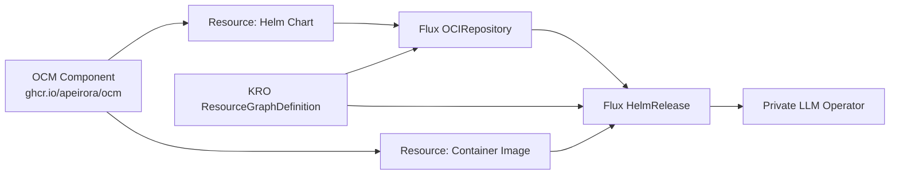

# OCM Installation

Deploy the Private LLM Operator using the [Open Component Model](https://ocm.software/) (OCM) supply chain. This approach packages the operator image and Helm chart into an OCM component, then uses KRO (Kubernetes Resource Orchestrator) and Flux to deploy it.

## Prerequisites

- Kubernetes cluster with:
  - [OCM Controller](https://github.com/open-component-model/open-component-model) installed
  - [KRO](https://github.com/kubernetes-sigs/kro) installed
  - [Flux](https://fluxcd.io/) controllers installed
- `kubectl`, `helm` 3.14+, `ocm` CLI
- `GITHUB_TOKEN` with read access to GHCR packages

## Architecture



The OCM component version contains two resources:
- **oci-helm-chart-private-llm-operator** -- the Helm chart as an OCI artifact
- **private-llm-image** -- the operator container image

KRO's `ResourceGraphDefinition` wires these together into a Flux `OCIRepository` + `HelmRelease` pipeline.

## Step 1: Set Up Credentials

```sh
# OCM controller needs GHCR access
kubectl -n ocm-system create secret docker-registry ghcr-credentials \
  --docker-server=ghcr.io \
  --docker-username="apeirora" \
  --docker-password="$GITHUB_TOKEN" \
  --dry-run=client -o yaml | kubectl apply -f -

kubectl -n ocm-system create serviceaccount ocm-repo-access --dry-run=client -o yaml | kubectl apply -f -
kubectl -n ocm-system patch serviceaccount ocm-repo-access \
  -p '{"imagePullSecrets":[{"name":"ghcr-credentials"}]}'

# Create OCM Repository reference
kubectl apply -f - <<'EOF'
apiVersion: delivery.ocm.software/v1alpha1
kind: Repository
metadata:
  name: apeirora-repository
  namespace: ocm-system
spec:
  repositorySpec:
    baseUrl: ghcr.io/apeirora/ocm
    type: OCIRegistry
  interval: 1m
  ocmConfig:
    - kind: Secret
      name: ghcr-credentials
EOF
```

## Step 2: Prepare the Workload Namespace

```sh
kubectl create namespace private-llm-operator || true
kubectl -n private-llm-operator create secret docker-registry ghcr-credentials \
  --docker-server=ghcr.io \
  --docker-username="apeirora" \
  --docker-password="$GITHUB_TOKEN" \
  --dry-run=client -o yaml | kubectl apply -f -
```

## Step 3: Configure Values

Create a `values.yaml` file:

```yaml
component:
  semver: "v2.8.1"    # OCM component version to deploy

operator:
  targetNamespace: private-llm-operator
  publicHost: llm.example.com
  publicScheme: https
  imagePullSecretName: ghcr-credentials
  traefikEnabled: true       # false if Traefik is managed externally
  tlsSecretName: "private-llm"
  ingressExtraAnnotations: {}
```

## Step 4: Render and Apply

```sh
helm template private-llm charts/private-llm-operator-ocm/ \
  -f charts/private-llm-operator-ocm/values.yaml \
  -f ./values.yaml \
  | kubectl apply -f -
```

This creates:
- An OCM `Component` pointing at the specified version
- A KRO `ResourceGraphDefinition` that orchestrates the deployment pipeline
- OCM `Resource` objects that resolve the chart and image references
- Flux `OCIRepository` and `HelmRelease` that deploy the operator

## Step 5: Verify

```sh
# Check the OCM component
kubectl get component -n ocm-system

# Check KRO resources
kubectl get resourcegraphdefinition

# Check Flux resources
kubectl get ocirepository -n private-llm-operator
kubectl get helmrelease -n private-llm-operator

# Check the operator
kubectl get pods -n private-llm-operator
```

## Upgrading

To upgrade, update `component.semver` in your values file and re-apply:

```sh
# Edit values.yaml: component.semver: "v2.9.0"
helm template private-llm charts/private-llm-operator-ocm/ \
  -f charts/private-llm-operator-ocm/values.yaml \
  -f ./values.yaml \
  | kubectl apply -f -
```

The OCM controller detects the version change, resolves new chart/image references, and KRO+Flux roll out the upgrade automatically.

## Publishing a Custom OCM Component

If you need to publish your own builds:

### 1. Build and push the operator image

```sh
export GH_OWNER=<your-github-username>
export SHA=$(git rev-parse --short HEAD)
export IMG=ghcr.io/$GH_OWNER/private-llm-controller:$SHA

docker build -t "$IMG" .
docker push "$IMG"
```

### 2. Package and push the Helm chart

```sh
cd charts/private-llm-operator
helm dependency update
export CHART_VER=0.0.0-$SHA
helm package . --version "$CHART_VER" --app-version "$CHART_VER"
echo "$GITHUB_TOKEN" | helm registry login ghcr.io -u "$GH_OWNER" --password-stdin
helm push ./private-llm-operator-$CHART_VER.tgz oci://ghcr.io/$GH_OWNER/charts
cd -
```

### 3. Create the OCM component version

```sh
export VERSION=$CHART_VER
export IMAGE_TAG=$SHA
export CHART_TAG=$CHART_VER
export OCM_REPOSITORY=oci://ghcr.io/$GH_OWNER/ocm

echo "$GITHUB_TOKEN" | ocm login ghcr.io -u "$GH_OWNER" -p-
ocm add componentversions --create --file dist/ctf .ocm/component-constructor.yaml \
  VERSION="$VERSION" GITHUB_REPOSITORY_OWNER="$GH_OWNER" IMAGE_TAG="$IMAGE_TAG" CHART_TAG="$CHART_TAG"
ocm transfer commontransportarchive dist/ctf "$OCM_REPOSITORY" --copy-resources --overwrite
```

### 4. Verify

```sh
ocm get components ghcr.io/$GH_OWNER/ocm//llm.privatellms.msp/private-llm:$VERSION
```

## Deploying Without OCM

If you prefer to skip OCM entirely and install the chart directly:

```sh
helm upgrade --install private-llm-operator charts/private-llm-operator \
  --namespace private-llm-operator --create-namespace \
  --set PUBLIC_HOST=llm.example.com \
  --set PUBLIC_SCHEME=https \
  --set tls.secretName=private-llm \
  --set image.repository=ghcr.io/apeirora/private-llm-controller \
  --set image.tag=2.8.1 \
  --set 'imagePullSecrets[0].name=ghcr-credentials' \
  --set traefik.enabled=false
```

See [Helm Installation](installation-helm.md) for full details.

## Next Steps

- [Create your first LLMInstance](resources.md)
- [Set up Platform Mesh integration](user-guide.md)
