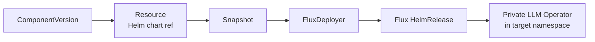

# OCM Installation

Deploy the Private LLM Operator using the [Open Component Model](https://ocm.software/) (OCM) supply chain. The OCM controller resolves the component version from an OCI registry, extracts the Helm chart via a `Resource`, and hands it to a `FluxDeployer` that creates a Flux `HelmRelease`.

---

## Prerequisites

- Kubernetes cluster with:
  - [OCM Controller](https://github.com/open-component-model/open-component-model) installed
  - [Flux](https://fluxcd.io/) controllers (source-controller, helm-controller)
- `kubectl`, `helm` 3.14+
- `GITHUB_TOKEN` with read access to GHCR packages

> **Note**: KRO is **not** required. The chart uses the OCM controller's built-in `FluxDeployer` to create the `HelmRelease` directly.

## Architecture



The Helm chart creates three OCM custom resources:

| Resource | Kind | Purpose |
|----------|------|---------|
| `private-llm-operator` | `ComponentVersion` | Points to the OCM component in the OCI registry |
| `private-llm-operator-chart` | `Resource` | Extracts the Helm chart artifact from the component |
| `private-llm-operator` | `FluxDeployer` | Creates a Flux `HelmRelease` from the extracted chart |

All three resources are created in the `ocm-system` namespace.

## Step 1: Create GHCR Credentials

The OCM controller needs pull access to `ghcr.io/apeirora`:

```sh
kubectl -n ocm-system create secret docker-registry ghcr-credentials \
  --docker-server=ghcr.io \
  --docker-username="apeirora" \
  --docker-password="$GITHUB_TOKEN" \
  --dry-run=client -o yaml | kubectl apply -f -
```

If the operator image is also private, create the same secret in the target namespace:

```sh
kubectl create namespace private-llm-system || true
kubectl -n private-llm-system create secret docker-registry ghcr-credentials \
  --docker-server=ghcr.io \
  --docker-username="apeirora" \
  --docker-password="$GITHUB_TOKEN" \
  --dry-run=client -o yaml | kubectl apply -f -
```

## Step 2: Configure Values

Create a `values.yaml` override file:

```yaml
component:
  semver: ">=2.0.1"               # semver constraint for the component version

operator:
  targetNamespace: private-llm-system
  publicHost: llm.example.com
  publicScheme: https
  imagePullSecretName: ghcr-credentials
  traefikEnabled: true             # false if Traefik is managed externally
  tlsSecretName: "private-llm"
  ingressExtraAnnotations: {}
```

### All Values

| Parameter | Description | Default |
|-----------|-------------|---------|
| `component.name` | Name for the OCM resources | `private-llm-operator` |
| `component.namespace` | Namespace for OCM resources | `ocm-system` |
| `component.componentName` | OCM component identity | `llm.privatellms.msp/private-llm` |
| `component.repositoryUrl` | OCI registry URL | `ghcr.io/apeirora/ocm` |
| `component.secretRefName` | Secret with registry credentials | `ghcr-credentials` |
| `component.semver` | Semver version or constraint | `>=2.0.1` |
| `component.interval` | Reconciliation interval | `1m` |
| `component.chartResourceName` | Name of the chart resource in the component | `oci-helm-chart-private-llm-operator` |
| `operator.targetNamespace` | Namespace where the operator is deployed | `private-llm-system` |
| `operator.publicHost` | Public hostname for the LLM API | `localhost` |
| `operator.publicScheme` | `http` or `https` | `http` |
| `operator.imagePullSecretName` | Image pull secret name | `ghcr-credentials` |
| `operator.traefikEnabled` | Deploy bundled Traefik | `true` |
| `operator.tlsSecretName` | TLS secret for ingress | `""` |
| `operator.ingressExtraAnnotations` | Extra ingress annotations | `{}` |

## Step 3: Install via Helm

```sh
helm template private-llm charts/private-llm-operator-ocm/ \
  -f charts/private-llm-operator-ocm/values.yaml \
  -f ./values.yaml \
  | kubectl apply -f -
```

This creates three resources in `ocm-system`:

1. **ComponentVersion** `private-llm-operator` -- resolves the component from `ghcr.io/apeirora/ocm`
2. **Resource** `private-llm-operator-chart` -- extracts the `oci-helm-chart-private-llm-operator` artifact
3. **FluxDeployer** `private-llm-operator` -- creates a `HelmRelease` targeting `private-llm-system`

The OCM controller reconciles the chain: `ComponentVersion` -> `Resource` -> `Snapshot` -> `FluxDeployer` -> `HelmRelease` -> operator pods.

## Step 4: Verify

```sh
# 1. ComponentVersion should be Ready
kubectl get componentversion -n ocm-system

# 2. Resource should be Ready with a Snapshot
kubectl get resource -n ocm-system
kubectl get snapshot -n ocm-system

# 3. FluxDeployer should have created a HelmRelease
kubectl get fluxdeployer -n ocm-system
kubectl get helmrelease -n ocm-system

# 4. Operator pods should be running
kubectl get pods -n private-llm-system
```

> **Tip**: If the `ComponentVersion` stays in a non-ready state, check that the `ghcr-credentials` secret exists in `ocm-system` and has valid credentials.

## Upgrading

Update `component.semver` in your values file and re-apply:

```sh
# Edit values.yaml: component.semver: ">=2.1.0"
helm template private-llm charts/private-llm-operator-ocm/ \
  -f charts/private-llm-operator-ocm/values.yaml \
  -f ./values.yaml \
  | kubectl apply -f -
```

The OCM controller detects the version change, resolves the new chart, and the `FluxDeployer` rolls out the upgrade via the `HelmRelease`.

## Manual Deployment via bootstrap.yaml

For quick testing without Helm, use `ocm/bootstrap.yaml` with `envsubst`:

```sh
export GH_OWNER=apeirora
export VERSION=">=2.0.1"

envsubst < ocm/bootstrap.yaml | kubectl apply -f -
```

This creates the same three resources (`ComponentVersion`, `Resource`, `FluxDeployer`) with sensible defaults. Edit the `FluxDeployer`'s `.spec.helmReleaseTemplate.values` section in the file to customize operator settings before applying.

## Publishing a Custom OCM Component

If you need to publish your own builds:

### 1. Build and push the operator image

```sh
export GH_OWNER=<your-github-username>
export SHA=$(git rev-parse --short HEAD)
export IMG=ghcr.io/$GH_OWNER/private-llm-controller:$SHA

docker build -t "$IMG" .
docker push "$IMG"
```

### 2. Package and push the Helm chart

```sh
cd charts/private-llm-operator
helm dependency update
export CHART_VER=0.0.0-$SHA
helm package . --version "$CHART_VER" --app-version "$CHART_VER"
echo "$GITHUB_TOKEN" | helm registry login ghcr.io -u "$GH_OWNER" --password-stdin
helm push ./private-llm-operator-$CHART_VER.tgz oci://ghcr.io/$GH_OWNER/charts
cd -
```

### 3. Create the OCM component version

```sh
export VERSION=$CHART_VER
export IMAGE_TAG=$SHA
export CHART_TAG=$CHART_VER
export OCM_REPOSITORY=oci://ghcr.io/$GH_OWNER/ocm

echo "$GITHUB_TOKEN" | ocm login ghcr.io -u "$GH_OWNER" -p-
ocm add componentversions --create --file dist/ctf .ocm/component-constructor.yaml \
  VERSION="$VERSION" GITHUB_REPOSITORY_OWNER="$GH_OWNER" IMAGE_TAG="$IMAGE_TAG" CHART_TAG="$CHART_TAG"
ocm transfer commontransportarchive dist/ctf "$OCM_REPOSITORY" --copy-resources --overwrite
```

### 4. Verify

```sh
ocm get components ghcr.io/$GH_OWNER/ocm//llm.privatellms.msp/private-llm:$VERSION
```

## Deploying Without OCM

If you prefer to skip OCM entirely and install the chart directly:

```sh
helm upgrade --install private-llm-operator charts/private-llm-operator \
  --namespace private-llm-system --create-namespace \
  --set PUBLIC_HOST=llm.example.com \
  --set PUBLIC_SCHEME=https \
  --set tls.secretName=private-llm \
  --set image.repository=ghcr.io/apeirora/private-llm-controller \
  --set image.tag=2.8.1 \
  --set 'imagePullSecrets[0].name=ghcr-credentials' \
  --set traefik.enabled=false
```

See [Helm Installation](installation-helm.md) for full details.

## Next Steps

- [Create your first LLMInstance](resources.md)
- [Set up Platform Mesh integration](user-guide.md)
