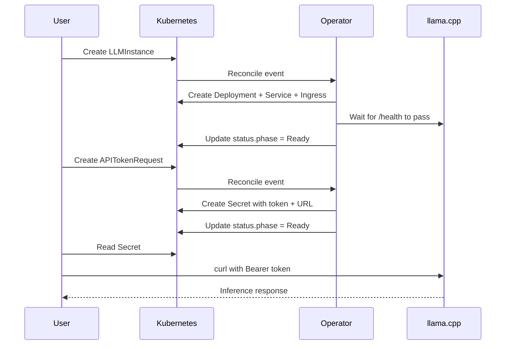

# Resource Guide

The operator manages two custom resources in the `llm.privatellms.msp` API group. This page provides a practical overview with examples.

---

## LLMInstance

**What it does:** Requests a private llama.cpp inference endpoint. The operator turns it into a Deployment, Service, Ingress, and Traefik middlewares.

**Key fields:**

| Field | Description | Default |
|-------|-------------|---------|
| `spec.model` | Model to deploy (`tinyllama`, `phi-2`, `gemma-3-1b-it`, `gemma-3-4b-it`, `gemma-3-12b-it`) | `tinyllama` |
| `spec.replicas` | Number of inference pods | `1` |

**What you read back:**

| Field | Description |
|-------|-------------|
| `status.phase` | `Provisioning` or `Ready` |
| `status.endpoint` | Public URL (e.g., `https://host/llm/<slug>`) |
| `status.conditions[].type=Ready` | Detailed readiness information |

### Minimal Example

```yaml
apiVersion: llm.privatellms.msp/v1alpha1
kind: LLMInstance
metadata:
  name: my-llm
spec:
  model: tinyllama
```

### Scaled Example

```yaml
apiVersion: llm.privatellms.msp/v1alpha1
kind: LLMInstance
metadata:
  name: production-llm
spec:
  model: gemma-3-4b-it
  replicas: 3
```

### Common Operations

```sh
# List all instances
kubectl get llminstances -o wide

# Watch provisioning progress
kubectl get llminstance my-llm -w

# Scale an existing instance
kubectl patch llminstance my-llm --type=merge -p '{"spec":{"replicas":3}}'

# Change model (triggers rolling update)
kubectl patch llminstance my-llm --type=merge -p '{"spec":{"model":"gemma-3-1b-it"}}'

# Delete (cleans up Deployment, Service, Ingress, and Middlewares)
kubectl delete llminstance my-llm
```

### What Gets Created

For each `LLMInstance`, the operator creates:

| Resource | Name Pattern | Purpose |
|----------|-------------|---------|
| Deployment | `<name>-llama` | llama.cpp server pods with init container for model download |
| Service | `<name>-llama` | ClusterIP service on port 8000 |
| Ingress | `<name>-llama` | Routes `<PUBLIC_HOST>/llm/<slug>` to the service |
| Middleware | `<name>-llama-strip` | Traefik StripPrefix to remove `/llm/<slug>` |
| Middleware | `<name>-llama-auth` | Traefik ForwardAuth for bearer token validation |

---

## APITokenRequest

**What it does:** Mints a bearer token for an existing LLMInstance. The token is stored in a Kubernetes Secret.

**Key fields:**

| Field | Description | Required |
|-------|-------------|----------|
| `spec.instanceName` | Target LLMInstance (same namespace) | Yes |
| `spec.description` | Human-friendly note | No |

**What you read back:**

| Field | Description |
|-------|-------------|
| `status.phase` | `Pending` or `Ready` |
| `status.secretName` | Name of the Secret with credentials |

### Minimal Example

```yaml
apiVersion: llm.privatellms.msp/v1alpha1
kind: APITokenRequest
metadata:
  name: my-token
spec:
  instanceName: my-llm
```

### With Description

```yaml
apiVersion: llm.privatellms.msp/v1alpha1
kind: APITokenRequest
metadata:
  name: ci-pipeline-token
spec:
  instanceName: production-llm
  description: "Token for CI/CD integration tests"
```

### Retrieving Credentials

```sh
# Wait for token to be ready
kubectl wait apitokenrequest/my-token --for=jsonpath='{.status.phase}'=Ready --timeout=60s

# Get secret name
SECRET=$(kubectl get apitokenrequest my-token -o jsonpath='{.status.secretName}')

# Extract credentials
OPENAI_API_KEY=$(kubectl get secret "$SECRET" -o jsonpath='{.data.OPENAI_API_KEY}' | base64 -d)
OPENAI_API_URL=$(kubectl get secret "$SECRET" -o jsonpath='{.data.OPENAI_API_URL}' | base64 -d)

echo "API Key: $OPENAI_API_KEY"
echo "API URL: $OPENAI_API_URL"
```

### Generated Secret Structure

```yaml
apiVersion: v1
kind: Secret
metadata:
  name: my-token-token
  labels:
    app.kubernetes.io/name: llm-token
    llm.privatellms.msp/instance: my-llm
    llm.privatellms.msp/apitokenrequest: my-token
    llm.privatellms.msp/slug: aB3xK9mLp2Qz
    apeirora.eu/llm-api-compatibility: openai
type: Opaque
data:
  OPENAI_API_KEY: <base64-encoded-random-token>
  OPENAI_API_URL: <base64-encoded-endpoint-url>
```

> **Note:** The `apeirora.eu/llm-api-compatibility: openai` label makes it easy for other operators (like Chat UI) to discover LLM credentials.

---

## Typical End-to-End Flow



1. Create an `LLMInstance` -- the operator provisions the infrastructure
2. Wait for `status.phase` to become `Ready`
3. Create an `APITokenRequest` referencing the instance
4. Retrieve `OPENAI_API_KEY` and `OPENAI_API_URL` from the generated Secret
5. Call the API with `Authorization: Bearer <token>` (see [API Reference](api-reference.md))
