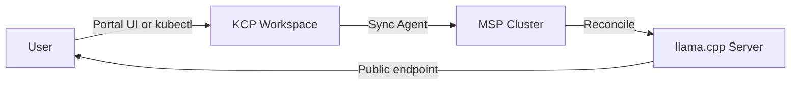

# User Guide

This guide covers how to use Private LLM through the ApeiroRA Platform Mesh portal and KCP workspaces.

---

## How It Works

When deployed as part of Platform Mesh, Private LLM appears as a managed service in the marketplace. Users interact with it through the portal UI or directly via KCP workspace APIs -- they never need direct access to the MSP cluster.



### Data Flow

1. **User creates resources** in their KCP workspace (via portal or kubectl)
2. **Sync agent** mirrors the resources to the MSP cluster
3. **Operator reconciles** -- creates Deployment, Service, Ingress
4. **Status flows back** -- phase, endpoint, and Secrets sync to KCP
5. **User calls the API** directly against the public endpoint

## Using the Portal UI

### Discovering Private LLM in the Marketplace

1. Log in to the ApeiroRA Platform Mesh portal
2. Navigate to your organization workspace
3. Open the **Marketplace** section
4. Find **LLM Service** in the provider list
5. Subscribe to the service (creates an APIBinding in your workspace)

### Creating an LLM Instance

1. In the sidebar, expand the **LLM by MODEL Corp** category
2. Click **Instances**
3. Click **Create**
4. Fill in:
   - **Name**: A unique name for your instance (e.g., `my-chatbot-backend`)
   - **Model**: Select from the dropdown (`tinyllama`, `phi-2`, `gemma-3-1b-it`, `gemma-3-4b-it`, `gemma-3-12b-it`)
   - **Replicas**: Number of inference pods (`1`, `3`, `6`, or `12`)
5. Click **Create**

The instance will show `Provisioning` status while the model downloads and the server starts. Once ready, the **Endpoint** column displays the public URL.

### Getting an API Token

1. In the sidebar, click **Token Requests**
2. Click **Create**
3. Fill in:
   - **Name**: A name for this token (e.g., `dev-token`)
   - **Instance**: Select the target LLMInstance from the dropdown
   - **Description**: Optional note
4. Click **Create**

Once the status shows `Ready`, navigate to **Secrets** in the sidebar to find the generated Secret with your `OPENAI_API_KEY` and `OPENAI_API_URL`.

### Viewing Secrets

The **Secrets** view in the sidebar shows all token Secrets with:
- **Token** (masked, with copy button)
- **OpenAI API URL**

## Using kubectl with KCP

If you prefer the command line, you can interact with your KCP workspace directly.

### Prerequisites

- kubectl with [KCP plugin](https://github.com/kcp-dev/kcp)
- Kubeconfig for your KCP workspace

### Create an LLM Instance

```sh
export KUBECONFIG=<your-workspace-kubeconfig>

kubectl apply -f - <<EOF
apiVersion: llm.privatellms.msp/v1alpha1
kind: LLMInstance
metadata:
  name: my-llm
spec:
  model: gemma-3-4b-it
  replicas: 2
EOF
```

### Monitor Provisioning

```sh
# Watch status
kubectl get llminstance my-llm -w

# Detailed status
kubectl get llminstance my-llm -o yaml
```

### Create a Token

```sh
kubectl apply -f - <<EOF
apiVersion: llm.privatellms.msp/v1alpha1
kind: APITokenRequest
metadata:
  name: my-token
spec:
  instanceName: my-llm
  description: "Token for testing"
EOF

# Wait for ready
kubectl wait apitokenrequest/my-token --for=jsonpath='{.status.phase}'=Ready --timeout=120s
```

### Retrieve Credentials

```sh
SECRET=$(kubectl get apitokenrequest my-token -o jsonpath='{.status.secretName}')
OPENAI_API_KEY=$(kubectl get secret "$SECRET" -o jsonpath='{.data.OPENAI_API_KEY}' | base64 -d)
OPENAI_API_URL=$(kubectl get secret "$SECRET" -o jsonpath='{.data.OPENAI_API_URL}' | base64 -d)

echo "API Key: $OPENAI_API_KEY"
echo "API URL: $OPENAI_API_URL"
```

### Call the API

```sh
# Health check
curl -s "$OPENAI_API_URL/health" \
  -H "Authorization: Bearer $OPENAI_API_KEY"

# Chat completion
curl -sS "$OPENAI_API_URL/v1/chat/completions" \
  -H "Authorization: Bearer $OPENAI_API_KEY" \
  -H "Content-Type: application/json" \
  -d '{
    "messages": [
      {"role": "system", "content": "You are a helpful assistant."},
      {"role": "user", "content": "What is Platform Mesh?"}
    ]
  }'
```

## Connecting Chat UI

The [Chat UI operator](https://github.com/apeirora/showroom-msp-chat-ui) can connect to Private LLM endpoints. The integration works through the `apeirora.eu/llm-api-compatibility: openai` label on the generated Secrets.

To connect Chat UI to your Private LLM instance:

1. Create an `LLMInstance` and an `APITokenRequest` as described above
2. Create a Chat UI instance referencing the same credentials
3. The Chat UI will use `OPENAI_API_KEY` and `OPENAI_API_URL` from the Secret

## Model Selection Guide

Choose a model based on your use case:

| Model | Best For | Memory | Speed |
|-------|----------|--------|-------|
| `tinyllama` | Testing, prototyping, demos | Low (~1 GB) | Fast |
| `phi-2` | General tasks, code generation | Medium (~2 GB) | Medium |
| `gemma-3-1b-it` | Lightweight production, edge | Low (~1 GB) | Fast |
| `gemma-3-4b-it` | Balanced quality/performance | Medium (~3 GB) | Medium |
| `gemma-3-12b-it` | High quality, complex reasoning | High (~8 GB) | Slower |

> **Tip:** Start with `tinyllama` for quick testing. For production workloads, `gemma-3-4b-it` offers a good balance. Use `gemma-3-12b-it` when response quality is critical.

## Scaling

### Horizontal Scaling

Increase the number of inference pods:

```sh
kubectl patch llminstance my-llm --type=merge -p '{"spec":{"replicas":3}}'
```

Traefik load-balances requests across all pods. Each pod runs an independent llama.cpp server with the full model loaded.

### Model Upgrade

Change the model on a running instance:

```sh
kubectl patch llminstance my-llm --type=merge -p '{"spec":{"model":"gemma-3-4b-it"}}'
```

This triggers a rolling update: new pods download the new model while old pods continue serving.

> **Warning:** Model changes cause a brief period where some requests may fail as pods restart. For zero-downtime model changes, create a new LLMInstance with the desired model, switch your APITokenRequest, and delete the old instance.

## Troubleshooting

### Instance stuck in Provisioning

Common causes:
- **Model download slow/failing**: Check init container logs
- **Insufficient resources**: The node may not have enough memory for the model
- **Image pull issues**: Check if the llama.cpp image is accessible

```sh
# Check pod status
kubectl get pods -l llm.privatellms.msp/instance=my-llm

# Check init container logs (model download)
kubectl logs <pod-name> -c download-model

# Check main container logs
kubectl logs <pod-name> -c llama-cpp-server
```

### Token request stuck in Pending

The APITokenRequest waits until the referenced LLMInstance is Ready:

```sh
# Check instance status
kubectl get llminstance <instance-name> -o jsonpath='{.status.phase}'

# Check token request conditions
kubectl get apitokenrequest <name> -o jsonpath='{.status.conditions}'
```

### API returns 401 Unauthorized

- Verify the bearer token is correct (copy from Secret, not from status)
- Ensure the token was created for the correct LLMInstance
- Check that the auth server is running:

```sh
# On the MSP cluster
kubectl logs deploy/private-llm-controller-manager -c manager | grep "auth"
```

## See Also

- [Architecture](architecture.md) -- how the operator and its components work
- [Release Flow](release-flow.md) -- how releases are cut and delivered
- [Versioning](versioning.md) -- version numbering and compatibility policy
